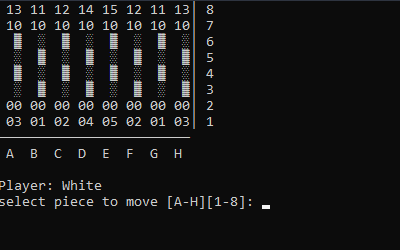

### cChess

## GAMEPLAY ## 
Scholar's mate:

## Features ##

* Movement validation
* Check detection
* Checkmate
* Stalemate 
* sucky ascii console graphics

## Notation ##

pieces are represented by two numbers.
The first being the color of the piece (0 = white, 1 = black)
The second being the ID of the piece (see below):
 - id 0 = pawn
 - id 1 = knight
 - id 2 = bishop
 - id 3 = rook
 - id 4 = queen
 - id 5 = king
 
 examples:
 - 00 = white pawn
 - 13 = black rook
 - 02 = white bishop
- etc...